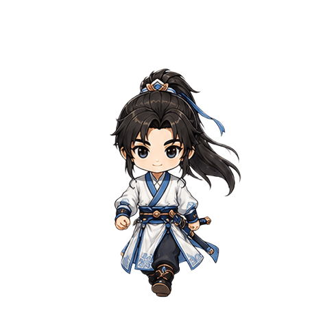

<a id="top"></a>

# AI Sprite Frame Align Tool · AI 動畫圖格對齊工具

<div align="center">

### 🌐 English　｜　[🇹🇼 繁體中文 ↓](#繁體中文)

</div>


A browser-based tool for cleaning up AI-generated sprite sheets and making their animation frames more stable for games.

**Live demo:** https://zxc02621948-sketch.github.io/ai-sprite-align-tool/ · **Changelog:** [CHANGELOG.md](CHANGELOG.md)

AI-generated sprite sheets often look good as still images, but the frames may not line up when played in sequence. Effects can cross the original grid, tails can be clipped, and multi-row animations can jump when the playback moves from one row to the next. This tool helps you define where each frame should be sampled from, align frames to a consistent anchor point, preview the animation, and export a corrected PNG.

> The tool's interface is primarily in Traditional Chinese.

## Demo

### Before alignment
The original AI-generated sprite sheet has inconsistent frame positions, causing visible jitter during playback.


### After alignment
After using this tool, the frames are aligned to a consistent anchor point, making the animation much more stable.


## What is a sprite sheet?
A **sprite** is a 2D image used in games (a character, enemy, item, effect, or UI icon). A **sprite sheet** is a single image containing multiple animation frames in rows and columns; games play them one by one to create animation.

```text
[Frame 1][Frame 2][Frame 3][Frame 4]
[Frame 5][Frame 6][Frame 7][Frame 8]
```

## Why this tool exists
AI image generators make impressive animation sheets, but they often have practical game-asset problems:
- The subject shifts between frames
- The feet / ground contact point doesn't stay stable
- Slash, impact, or explosion effects extend outside the original grid
- The tail of one frame overlaps the start of another
- Multi-row animations jump when playback moves from one row to the next
- The animation looks shaky when imported into a game

This tool treats the original grid as a starting point, not an unchangeable boundary. You can manually adjust each frame's source rectangle, then let the tool align the resulting frames.

## Key features
- Drag and drop PNG / JPG / WebP sprite sheets
- Set custom columns and rows (`4x2`, `8x1`, …)
- Automatic frame analysis using transparency / alpha data; re-analyzes new images without reusing previous positioning
- Source-rectangle editing per frame (drag to include clipped tails or avoid neighbors; reset back to the grid cell)
- Anchor modes: subject center / bottom center / visual center of mass
- Reference-frame alignment, row-by-row alignment, shared impact point (for multi-row slash / impact / explosion sheets)
- Overflow sampling margin + automatic output-frame expansion to prevent clipping
- Cleaner source-rect editing view, hover tooltips, dark dropdowns
- Animation preview; export corrected PNG, or PNG + JSON frame data; copy Godot / Unity import settings
- Runs locally in the browser, no installation

## Main workflow
1. Open `index.html`.
2. Drop a sprite sheet in, or click open-file.
3. Set the column and row count.
4. Choose an anchor mode.
5. If a frame is clipped or overlaps another, enable **Edit Source Rect**.
6. Click the frame to adjust; drag inside the blue rectangle to move it, drag an edge/corner to resize.
7. Click **Auto Align**.
8. Preview the animation, then export the corrected PNG (or PNG + data, or copy Godot / Unity settings).

## Source rectangle editing
The source rectangle is the area sampled from the original image for a frame. By default it equals the original grid cell; if a frame's tail extends past the cell, enable **Edit Source Rect** and resize the blue rectangle to include it. While editing, the tool hides most other guide boxes, prioritizes the clicked grid cell, keeps editing the selected frame even if the mouse slightly crosses into a neighbor, and **Reset Source Rect** restores the original grid cell. This is the recommended fix for overlapping AI frame tails.

## Alignment options
**Anchor mode** — which point to align across frames:
- **Bottom center**: grounded characters, impact effects, explosions
- **Subject center**: slashes, projectiles, floating effects
- **Visual center of mass**: irregular shapes with stable alpha distribution

**Row-by-row alignment** — each row uses the same column in that row as reference (e.g. `4x2` with reference frame 1: row 1 → frame 1, row 2 → frame 5). Useful when rows are separate phases; if rows are one continuous animation it may cause a jump between rows, so try turning it off.

**Shared impact point** — aligns all frames to one common hit point. Use it when a multi-row sheet is one continuous effect (slash → impact → explosion). A good starting point: Shared Impact Point ON, Row-by-row OFF, Anchor = Bottom/Subject center.

## Recommended settings
- **Character / grounded effects:** Bottom center · row-by-row ON if rows are separate (OFF if continuous) · shared impact usually OFF
- **Slash / impact / explosion:** Subject or Bottom center · shared impact ON · row-by-row usually OFF if one continuous animation · use Edit Source Rect for clipped/overlapping tails
- **Effects crossing the grid:** increase overflow sampling margin, edit source rects for problem frames, keep output expansion on

## Visual guide
- Blue rectangle: the frame's source rectangle
- Blue handles: drag points for the selected source rectangle
- Gold frame: original grid cell
- White dashed frame: overflow sampling area
- Green frame: detected subject bounds
- Red dot: current alignment anchor

## Notes
Works best with transparent PNG sprite sheets — for solid black/white/colored backgrounds, remove the background first or alpha detection may miss the subject. With output-frame expansion on, the exported sheet may be larger than the original (transparent safety space around each frame, not a downscale); import using the new frame size and scale in code if needed.

## Use cases
AI character attack animations · RPG battle sprites · enemy animation sheets · skill-effect sprite sheets · slash/impact/explosion cleanup · 2D game asset prep · game-jam asset correction

## Running locally
Open `index.html` directly, or use the included Windows shortcut `run.bat`.

## ☕ Support
This tool is free and open source. If it helps you, consider buying me a coffee: https://ko-fi.com/kuanming

## License
Code is released under the MIT License (see [LICENSE](LICENSE)). Demo images, GIFs, sprite sheets, and other visual assets are for demonstration/documentation only and are not part of the MIT-licensed code unless explicitly stated.

---

## 繁體中文

<div align="center">

### [🌐 English ↑](#top)　｜　🇹🇼 繁體中文

</div>

一個本地瀏覽器工具,用來整理 AI 生成的 spritesheet,讓動畫播放時更穩、更適合放進遊戲。

**線上工具:** https://zxc02621948-sketch.github.io/ai-sprite-align-tool/ · **更新日誌:** [CHANGELOG.md](CHANGELOG.md)

AI 生成的動畫圖常常單張看起來很漂亮,但實際播放時會出現問題:每格位置不一致、上下排接續會跳、斬擊尾韻被格線切掉,或某一格的尾巴跟隔壁格的開端黏在一起。這個工具會把原本的平均格線當作初始參考(而非死板邊界),你可以針對每一格手動調整「來源框」,再讓工具依錨點自動對齊並匯出新的 PNG。介面以繁體中文為主。

### 新功能:現在能對齊「人物行走圖」
過去只能對齊特效(爆炸、斬擊那種逐格素材),現在加入「人物行走圖」模式。AI 生成的角色行走圖每格位置常不一致,丟進來選 `3x4 行走`、按一下自動對齊就能順順走。也處理了 AI 行走圖常見的麻煩:頭髮飄動會把整個身體往旁邊拉、播放起來左右晃 —— 工具改成偵測「身體核心」來對齊、忽略飄動的頭髮。



### 展示效果
**修正前**:每格位置不一致,播放明顯抖動。


**修正後**:每格主體位置更穩定,動畫更順。


### 什麼是 Sprite / Spritesheet?
**Sprite** 是遊戲中使用的 2D 圖像(角色、敵人、道具、特效、UI 圖示等)。**Spritesheet** 把多張動畫格集中在同一張圖,遊戲依序切出每格播放形成動畫。如果每格主體/特效中心沒對齊,播放時就會抖動或亂飄。

### 為什麼需要這個工具?
AI 生成 spritesheet 常見問題:每格位置不同、播放會抖、腳底或命中點不穩、斬擊/爆炸/光效超出原格、某格尾韻跟隔壁格開端黏住、上排播到下排會跳。本工具的重點不是只靠自動猜,而是讓你定義「這一格該從原圖哪個範圍取」,來源框調好後再對齊輸出。

### 功能
- 拖放 PNG / JPG / WebP spritesheet、可設欄列數(`4x2`、`8x1`)
- 自動切格並偵測每格主體;換新圖會重新分析,不沿用上一張定位
- 單格來源框編輯(拖曳納入尾韻或避開隔壁、可重設回平均格)
- 多種對齊:主體中心 / 底部中心 / 視覺重心;可選基準格、逐列對齊、共享命中點
- 取樣外溢邊距 + 自動擴大輸出格子避免裁切
- 編輯時簡化畫面、重要控制項有滑鼠提示、深色下拉
- 即時播放預覽;匯出修正後 PNG、或 PNG + JSON 格子資料;可複製 Godot / Unity 匯入設定
- 完全本地運作,免安裝

### 基本使用方式
1. 打開 `index.html`
2. 拖入 spritesheet 或按開啟圖檔
3. 設定欄數與列數
4. 選擇對齊方式
5. 某格被切到或吃到隔壁 → 開啟**編輯來源框**
6. 點要修正的格子;拖框內移動、拖邊角縮放
7. 按**自動對齊**
8. 播放預覽,確認後匯出修正後 PNG(或 PNG + 資料,或複製 Godot / Unity 設定)

### 遊戲引擎匯出
按「匯出 PNG + 資料」會下載:對齊後透明 PNG + 對應 JSON(欄列數、單格尺寸、總格數、FPS、輸出尺寸,以及每格 `x,y,w,h` 與錨點)。也可「複製 Godot 設定」/「複製 Unity 設定」。匯入後比例看起來不同時,可在 Godot 節點 Scale 或 Unity Transform Scale 調整。

### 與遊戲素材去背助手連動
本工具可接收 [遊戲素材去背助手](https://zxc02621948-sketch.github.io/game-asset-bg-remover/) 處理後的透明 PNG。流程:去背 → 按「送到動畫格對齊」→ 設定欄列並自動對齊 → 匯出整理後的透明 spritesheet。同網域下去背工具會把圖暫存本機瀏覽器並自動載入本工具。

### 來源框編輯
來源框代表「這一格要從原圖哪個範圍取圖」。預設等於平均格線;某格尾韻超出時,開啟**編輯來源框**把藍框拉大或移動。編輯時會隱藏多數偵測框、點在原平均格內會優先選該格、拉邊角時即使滑鼠稍跨隔壁也會繼續拉目前框、**重設來源框**可恢復成原平均格。這是處理「尾韻被切掉/相鄰格黏住」最推薦的方式。

### 對齊選項說明
**對齊方式/錨點**:底部中心(角色、落地爆炸、地面特效)、主體中心(斬擊、飛行物、光球)、視覺重心(形狀不規則但透明像素分布穩定)。
**逐列對齊**:每列用該列同欄的格子當基準(`4x2` 基準格 1 → 第1列用第1格、第2列用第5格)。上下排是不同段落時開啟;同一段連續動畫時關閉,以免跨列跳一下。
**共享命中點**:把所有格對到同一命中中心,適合「斬擊→命中→爆炸」這種連續特效。常用起手式:共享命中點開、逐列對齊關、錨點用底部或主體中心。

### 建議設定
- **角色/地面特效**:底部中心 · 不同段落開逐列(連續則關)· 共享命中通常關
- **斬擊/命中/爆炸**:主體或底部中心 · 共享命中開 · 連續動畫逐列通常關 · 尾韻被切就用編輯來源框
- **特效超出格線**:調大取樣外溢邊距、對問題格用編輯來源框、保持自動擴大輸出格子

### 視覺標記
藍框=來源框 · 藍控制點=選中框可拖點 · 金框=原始平均格線 · 白虛線=外溢取樣範圍 · 綠框=偵測到的主體範圍 · 紅點=目前對齊錨點。開啟編輯來源框時會簡化畫面只保留來源框相關標記。

### 注意事項
透明背景 PNG 效果最好;黑底/白底/純色背景請先去背,否則可能無法正確判斷主體。開啟自動擴大輸出格子後,匯出尺寸可能比原圖大(每格周圍多了透明安全邊,不是縮小);放進遊戲要用新格子尺寸切圖,看起來變小可在程式裡調顯示尺寸。

### 適合用途
AI 角色攻擊動畫 · RPG 戰鬥 sprites · 敵人動畫圖 · 技能特效 spritesheet · 斬擊/命中/爆炸整理 · 2D 遊戲素材前處理 · Game jam 素材修正

### 本地執行
直接開啟 `index.html`,或用內附的 Windows 捷徑 `run.bat`。

### ☕ 支持作者
這個工具是免費且開源的。如果它對你有幫助,歡迎請我喝杯咖啡,支持我持續維護與開發更多免費工具:
👉 https://ko-fi.com/kuanming

### 授權
本專案程式碼採用 MIT License(詳見 [LICENSE](LICENSE))。倉庫中的示範圖片、GIF、spritesheet 與其他視覺素材僅供展示與文件說明,除非另有標示,否則不含在 MIT 授權的程式碼範圍內。
