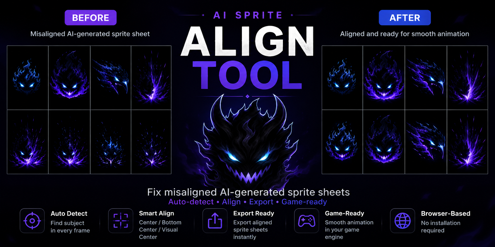
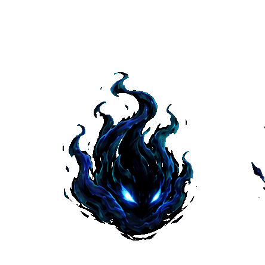
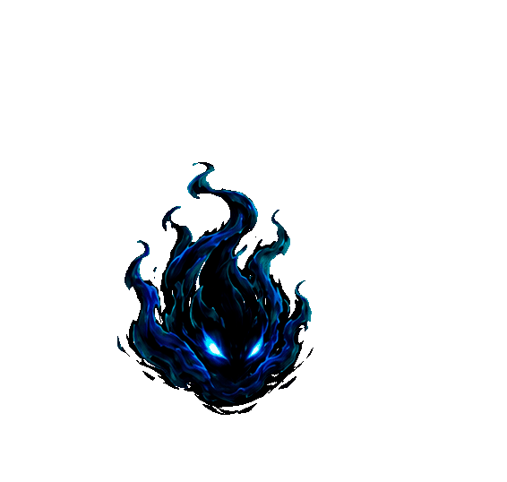
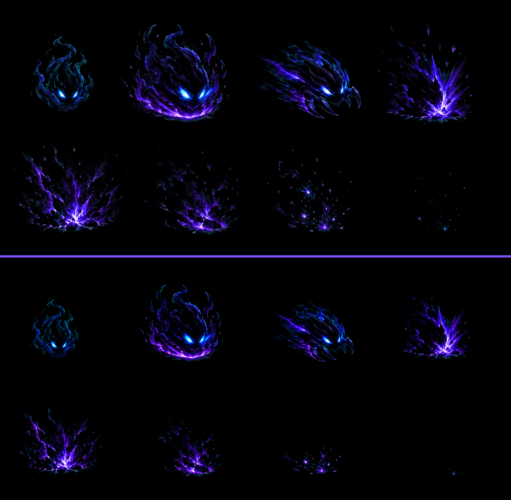

# AI 動畫圖格對齊工具



## 線上工具

https://zxc02621948-sketch.github.io/ai-sprite-align-tool/

這是一個本地瀏覽器工具，用來整理 AI 生成的 spritesheet，讓動畫播放時更穩、更適合放進遊戲。

AI 生成的動畫圖常常單張看起來很漂亮，但實際播放時會出現問題：每格位置不一致、上下排接續會跳、斬擊尾韻被格線切掉，或某一格的尾巴跟隔壁格的開端黏在一起。

這個工具會把原本的平均格線當作初始參考，而不是死板邊界。你可以針對每一格手動調整「來源框」，再讓工具依照錨點自動對齊並匯出新的 PNG。

目前工具介面以繁體中文為主。

---

## 展示效果

### 修正前

原本 AI 生成的 spritesheet 每格位置不一致，播放時會明顯抖動。



### 修正後

使用工具對齊後，每格主體位置更穩定，動畫播放也更順。





---

## 什麼是 Sprite / Spritesheet？

**Sprite** 是遊戲中使用的 2D 圖像，例如角色、敵人、道具、攻擊特效、火球、斬擊、爆炸或 UI 圖示。

**Spritesheet** 是把多張動畫格集中在同一張圖片裡。遊戲會依序切出每一格播放，形成動畫。

例如：

```text
[第1格][第2格][第3格][第4格]
[第5格][第6格][第7格][第8格]
```

如果每一格主體或特效中心沒有對齊，播放時就會抖動或亂飄。

---

## 為什麼需要這個工具？

AI 生成的 spritesheet 常見問題：

* 每一格角色或特效位置不同
* 播放起來會抖動
* 腳底或命中點不穩
* 斬擊、爆炸、光效超出原本格子
* 某一格尾韻跟隔壁格開端黏在一起
* 上排播放到下排時會跳一下

這個工具的重點不是只靠自動猜測，而是讓你可以定義「這一格應該從原圖哪個範圍取」。來源框調整好後，再進行對齊與輸出。

---

## 功能

* 支援拖放 PNG / JPG / WebP spritesheet
* 可設定欄列數，例如 `4x2`、`8x1`
* 自動切格並偵測每格主體範圍
* 換新圖片時會重新分析格子，不沿用上一張圖的定位資料
* 可針對單格編輯來源框
* 可拖曳來源框，把框外尾韻納入，或避開隔壁格
* 可重設選中格的來源框
* 支援多種對齊方式：
  * 主體中心
  * 底部中心
  * 視覺重心
* 可選擇基準格
* 支援逐列對齊
* 支援共享命中點，適合跨列接續的斬擊、命中、爆炸動畫
* 支援取樣外溢邊距
* 支援自動擴大輸出格子，避免特效被裁切
* 編輯來源框時會簡化畫面，只保留關鍵來源框
* 重要控制項有滑鼠提示說明
* 下拉選單改為深色樣式，避免看不清楚
* 可即時播放預覽動畫
* 可匯出修正後 PNG
* 可匯出 PNG + JSON 格子資料
* 可複製 Godot / Unity 匯入設定
* 完全本地運作，不需要安裝

---

## 基本使用方式

1. 打開 `index.html`。
2. 將 spritesheet 拖進工具，或按開啟圖檔。
3. 設定欄數與列數。
4. 選擇對齊方式。
5. 如果某一格被切到或吃到隔壁，開啟 **編輯來源框**。
6. 點選要修正的格子。
7. 拖曳藍色來源框內部可以移動來源框。
8. 拖曳藍色來源框的邊或角可以縮放來源框。
9. 按 **自動對齊**。
10. 播放預覽，確認動畫是否穩定。
11. 匯出修正後 PNG。
12. 如果要放進遊戲引擎，可使用 **匯出 PNG + 資料** 或複製 Godot / Unity 設定。

---

## 遊戲引擎匯出

按 **匯出 PNG + 資料** 會下載：

* 對齊後的透明 spritesheet PNG
* 對應的 JSON 格子資料

JSON 會包含欄列數、單格尺寸、總格數、播放 FPS、輸出圖片尺寸，以及每一格的 `x, y, w, h` 與錨點資訊。

如果只想快速匯入遊戲引擎，可以使用：

* **複製 Godot 設定**
* **複製 Unity 設定**

複製內容會列出欄列數、單格尺寸與建議 FPS。匯入後如果畫面比例看起來不同，可以在 Godot 節點 Scale 或 Unity Transform Scale 調整顯示大小。

---

## 與遊戲素材去背助手連動

本工具可以接收 [遊戲素材去背助手](https://zxc02621948-sketch.github.io/game-asset-bg-remover/) 處理後的透明 PNG。

建議流程：

```text
遊戲素材去背助手
→ 去除黑底、白底或綠幕背景
→ 送到動畫格對齊工具
→ 設定欄列數並自動對齊
→ 匯出整理後的透明 spritesheet
```

在同一個 GitHub Pages 網域下，去背工具會把目前圖片暫存在本機瀏覽器，並開啟本工具自動載入該圖片。

---

## 來源框編輯

來源框代表「這一格要從原圖哪個範圍取圖」。

預設每一格來源框等於平均格線。如果某一格的尾韻超出格線，開啟 **編輯來源框**，把藍色來源框拉大或移動，讓它包含正確內容。

編輯來源框時：

* 畫面會隱藏多數偵測框，避免干擾。
* 點在原始平均格內時，會優先選該格。
* 如果正在拉目前選中來源框的邊或角，即使滑鼠稍微跨到隔壁格，也會繼續拉目前選中的框。
* **重設來源框** 可以把目前選中的格子恢復成原始平均格線。

這是處理「尾韻被切掉」或「相鄰格互相黏住」最推薦的方式。

---

## 對齊選項說明

### 對齊方式 / 錨點

選擇每一格要用哪個點來對齊。

* **底部中心**：適合角色、落地爆炸、地面特效。
* **主體中心**：適合斬擊、飛行物、光球或中心穩定的特效。
* **視覺重心**：適合形狀不規則，但透明像素分布穩定的特效。

### 逐列對齊

開啟後，每一列會使用該列同欄的格子當基準。

例如 `4x2` 並且基準格是第 1 格：

```text
第 1 列用第 1 格當基準
第 2 列用第 5 格當基準
```

如果上下排是不同動作段落，逐列對齊會有幫助。

如果上下排其實是同一段動畫的連續播放，逐列對齊可能會讓跨列接續時跳一下。這種情況可以關掉。

### 共享命中點

共享命中點會把所有格子對到同一個命中中心。

適合這類 spritesheet：

```text
斬擊 -> 命中 -> 爆炸
```

如果一段動畫被排成上下兩列，通常可以先試：

```text
共享命中點：開啟
逐列對齊：關閉
對齊方式：底部中心 或 主體中心
```

---

## 建議設定

角色或地面特效：

```text
對齊方式：底部中心
逐列對齊：上下排是不同段落時開啟；同一段動畫接續時關閉
共享命中點：通常關閉，除非每格都要對到同一命中點
```

斬擊、命中、爆炸類特效：

```text
對齊方式：主體中心 或 底部中心
共享命中點：開啟
逐列對齊：如果上下排是同一段動畫，通常關閉
編輯來源框：用來修正被切掉的尾韻或重疊的格子
```

特效超出原本格線時：

```text
調整取樣外溢邊距
針對問題格使用編輯來源框
保持自動擴大輸出格子
```

---

## 視覺標記

* 藍色框：該格的來源框
* 藍色控制點：目前選中來源框可拖曳的位置
* 金色框：原始平均格線
* 白色虛線框：外溢取樣範圍
* 綠色框：偵測到的主體範圍
* 紅點：目前對齊錨點

開啟 **編輯來源框** 時，工具會簡化畫面，只保留來源框相關標記，方便調整。

---

## 注意事項

透明背景 PNG 效果最好。

如果圖片是黑底、白底或其他純色背景，建議先去背再使用，否則工具可能無法正確判斷主體範圍。

開啟自動擴大輸出格子後，匯出的 spritesheet 尺寸可能會比原圖大。這不是把圖縮小，而是每一格周圍多了透明安全邊，避免特效被裁切。

放進遊戲時，要用匯出後的新格子尺寸切圖。如果畫面上看起來變小，可以在遊戲程式裡調整顯示尺寸。

---

## 適合用途

* AI 生成角色攻擊動畫
* RPG 戰鬥 sprites
* 敵人動畫圖
* 技能特效 spritesheet
* 斬擊、命中、爆炸動畫整理
* 2D 遊戲素材前處理
* Game jam 素材修正

---

# English: AI Sprite Align Tool

## Live Demo

https://zxc02621948-sketch.github.io/ai-sprite-align-tool/

A browser-based tool for cleaning up AI-generated sprite sheets and making their animation frames more stable for games.

AI-generated sprite sheets often look good as still images, but the frames may not line up when played in sequence. Effects can cross the original grid, tails can be clipped, and multi-row animations can jump when the playback moves from one row to the next.

This tool helps you define where each frame should be sampled from, align frames to a consistent anchor point, preview the animation, and export a corrected PNG.

The current tool interface is primarily in Traditional Chinese.

---

## Demo

### Before Alignment

The original AI-generated sprite sheet has inconsistent frame positions, causing visible jitter during playback.


### After Alignment

After using this tool, the frames are aligned to a consistent anchor point, making the animation much more stable.


---

## What is a Sprite Sheet?

A **sprite** is a 2D image used in games, such as a character, enemy, item, effect, or UI icon.

A **sprite sheet** is a single image that contains multiple animation frames arranged in rows and columns. Games play these frames one by one to create animation.

Example:

```text
[Frame 1][Frame 2][Frame 3][Frame 4]
[Frame 5][Frame 6][Frame 7][Frame 8]
```

---

## Why This Tool Exists

AI image generators can create impressive animation sheets, but they often have practical game-asset problems:

* The subject shifts between frames
* The feet or ground contact point does not stay stable
* Slash, impact, or explosion effects extend outside the original grid
* The tail of one frame overlaps the beginning of another frame
* Multi-row animations jump when playback moves from one row to the next
* The animation looks shaky when imported into a game

This tool treats the original grid as a starting point, not as an unchangeable boundary. You can manually adjust each frame's source rectangle, then let the tool align the resulting frames.

---

## Key Features

* Drag and drop PNG / JPG / WebP sprite sheets
* Set custom columns and rows
* Automatic frame analysis using transparency / alpha data
* Re-analyzes new images without reusing positioning data from the previous image
* Source rectangle editing for individual frames
* Drag a source rectangle to include clipped tails or avoid neighboring frames
* Reset a selected source rectangle back to the original grid cell
* Anchor modes:
  * Subject center
  * Bottom center
  * Visual center of mass
* Reference frame alignment
* Row-by-row alignment mode
* Shared impact point mode for multi-row slash / impact / explosion sheets
* Overflow sampling margin for effects that cross frame borders
* Automatic output frame expansion to prevent clipping
* Cleaner source-rectangle editing view that hides distracting guide boxes
* Hover tooltips for important controls
* Dark dropdown styling for better readability
* Animation preview
* Export the corrected sprite sheet as PNG
* Runs locally in the browser
* No installation required

---

## Main Workflow

1. Open `index.html` in your browser.
2. Drop a sprite sheet image into the tool, or click the open file button.
3. Set the correct column and row count, such as `4x2` or `8x1`.
4. Choose an anchor mode.
5. If a frame is clipped or overlaps with another frame, enable **Edit Source Rect**.
6. Click the frame you want to adjust.
7. Drag inside the blue source rectangle to move it.
8. Drag an edge or corner to resize it.
9. Click **Auto Align**.
10. Preview the animation.
11. Export the corrected PNG.

---

## Source Rectangle Editing

The source rectangle is the area sampled from the original image for a frame.

By default, each source rectangle starts as the original grid cell. If a frame's visual tail extends outside that grid cell, enable **Edit Source Rect** and resize the blue rectangle to include it.

When editing source rectangles:

* The tool hides most other guide boxes so the blue source rectangles are easier to read.
* Clicking inside an original grid cell prioritizes that grid cell.
* Dragging a selected source rectangle edge keeps editing that selected frame, even if the mouse slightly crosses into a neighboring cell.
* **Reset Source Rect** restores the selected frame to the original grid cell.

This is the recommended fix for AI sheets where frame tails and neighboring frame starts overlap.

---

## Alignment Options

### Anchor Mode

Choose which point should be aligned across frames.

* **Bottom Center**: good for grounded characters, impact effects, and explosions.
* **Subject Center**: good for slash effects, projectiles, or floating effects.
* **Visual Center of Mass**: useful when the visible alpha distribution is more stable than the bounding box.

### Row-by-row Alignment

When enabled, each row uses the same column in that row as its reference.

For a `4x2` sheet with reference frame 1:

```text
Row 1 uses frame 1 as reference.
Row 2 uses frame 5 as reference.
```

This is useful when rows are separate animation phases.

If the rows are part of one continuous animation, row-by-row alignment may cause a jump between rows. In that case, try disabling it.

### Shared Impact Point

Shared impact point aligns all frames toward one common hit point.

Use it when a multi-row sheet is one continuous effect, such as:

```text
slash frames -> impact frames -> explosion frames
```

For many AI-generated attack effects, a good starting point is:

```text
Shared Impact Point: ON
Row-by-row Alignment: OFF
Anchor Mode: Bottom Center or Subject Center
```

---

## Recommended Settings

For character or grounded effects:

```text
Anchor Mode: Bottom Center
Row-by-row Alignment: ON if rows are separate, OFF if rows are continuous
Shared Impact Point: OFF unless rows should connect at one hit point
```

For slash / impact / explosion sheets:

```text
Anchor Mode: Subject Center or Bottom Center
Shared Impact Point: ON
Row-by-row Alignment: usually OFF if the rows are one continuous animation
Edit Source Rect: use when a tail is clipped or overlaps another frame
```

For effects crossing the original grid:

```text
Increase Overflow Sampling Margin
Use Edit Source Rect for the specific problem frames
Keep output frame expansion enabled
```

---

## Visual Guide

* Blue rectangle: source rectangle used for that frame
* Blue handles: drag points for the selected source rectangle
* Gold frame: original grid cell
* White dashed frame: overflow sampling area
* Green frame: detected subject bounds
* Red dot: current alignment anchor

When **Edit Source Rect** is enabled, the tool hides most guide boxes and focuses on the blue source rectangles.

---

## Notes

This tool works best with transparent PNG sprite sheets.

If the image has a solid black, white, or colored background, alpha-based detection may not correctly detect the real subject. Removing the background first will improve the result.

When output frame expansion is enabled, the exported sprite sheet may become larger than the original image. This does not mean the sprite itself was scaled down. The tool adds transparent safety space around each frame so effects are not clipped.

When importing the exported sheet into a game, use the new exported frame size instead of the old original frame size. If needed, scale the displayed sprite in code.

---

## Use Cases

* AI-generated character attack animations
* RPG battle sprites
* Enemy animation sheets
* Skill effect sprite sheets
* Slash / impact / explosion animation cleanup
* 2D game asset preparation
* Game jam asset correction

---

## 本地執行 / Running Locally

你可以直接開啟工具：

You can open the tool directly:

```text
index.html
```

或使用內附的 Windows 捷徑：

Or use the included Windows shortcut:

```bat
run.bat
```

---

## 授權

本專案程式碼採用 MIT License 授權，詳見 [LICENSE](LICENSE)。

倉庫中的示範圖片、GIF、spritesheet 與其他視覺素材僅供展示與文件說明使用，除非另有明確標示，否則不包含在 MIT 授權的程式碼範圍內。

## License

Code is released under the MIT License. See [LICENSE](LICENSE).

Demo images, GIFs, sprite sheets, and other visual assets in this repository are included for demonstration and documentation purposes only. They are not part of the MIT-licensed source code unless explicitly stated otherwise.
